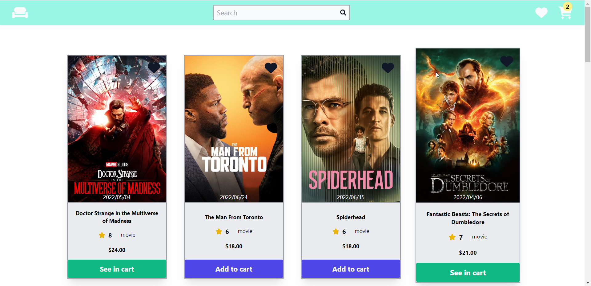
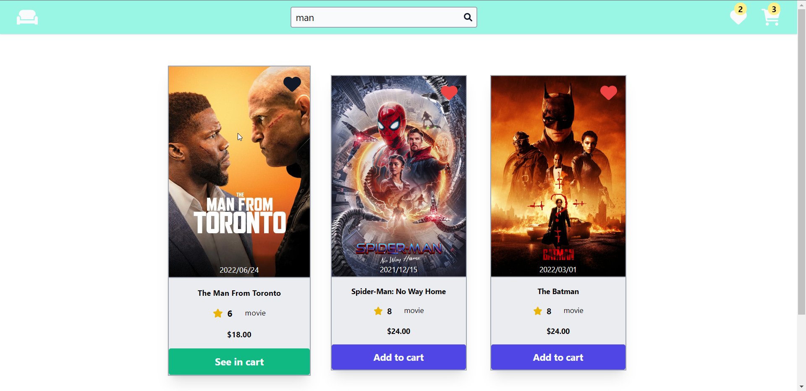
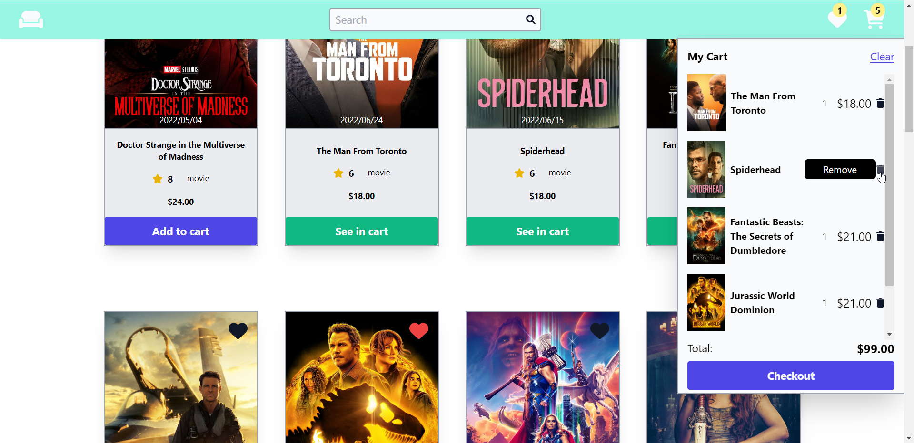
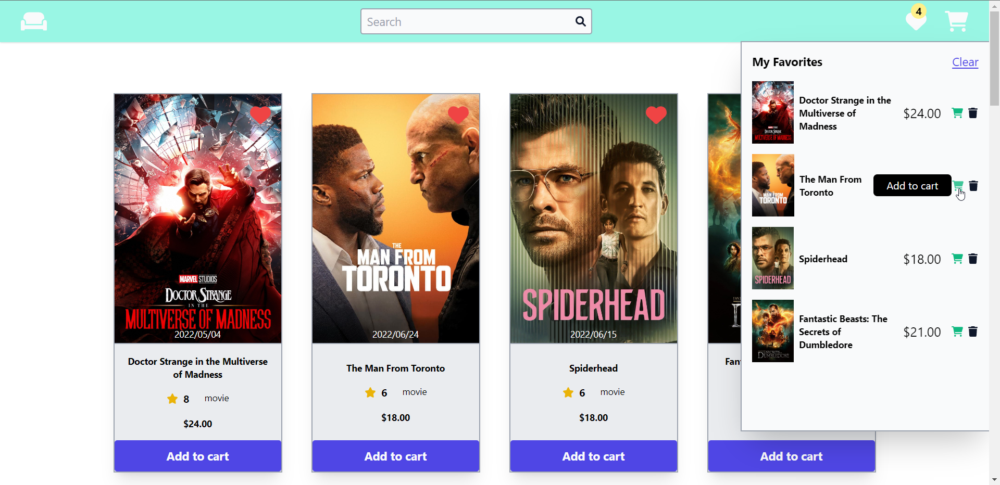
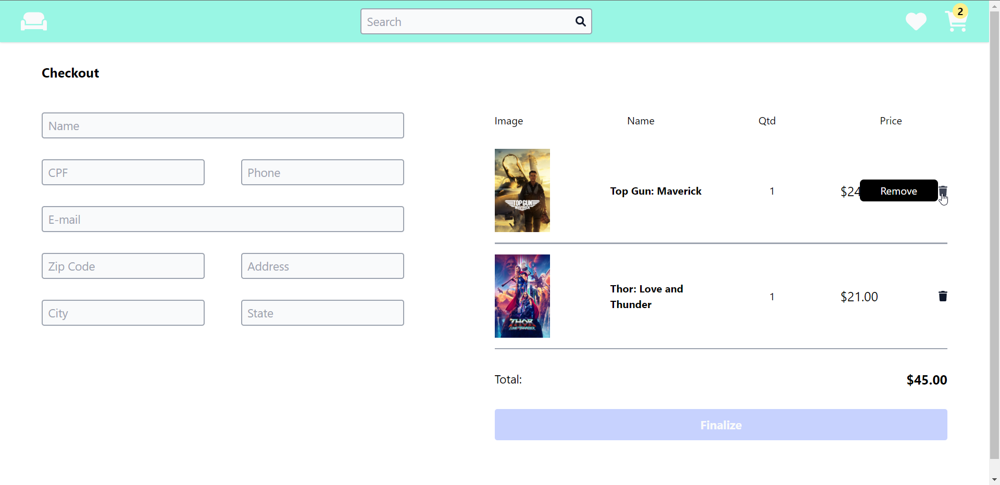
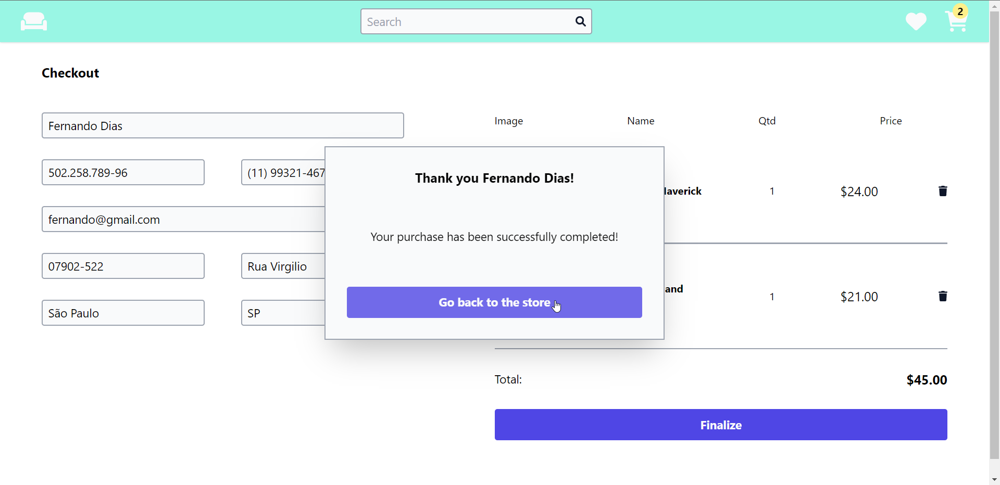
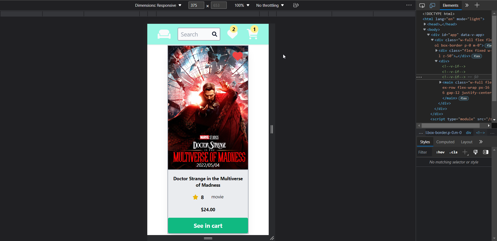
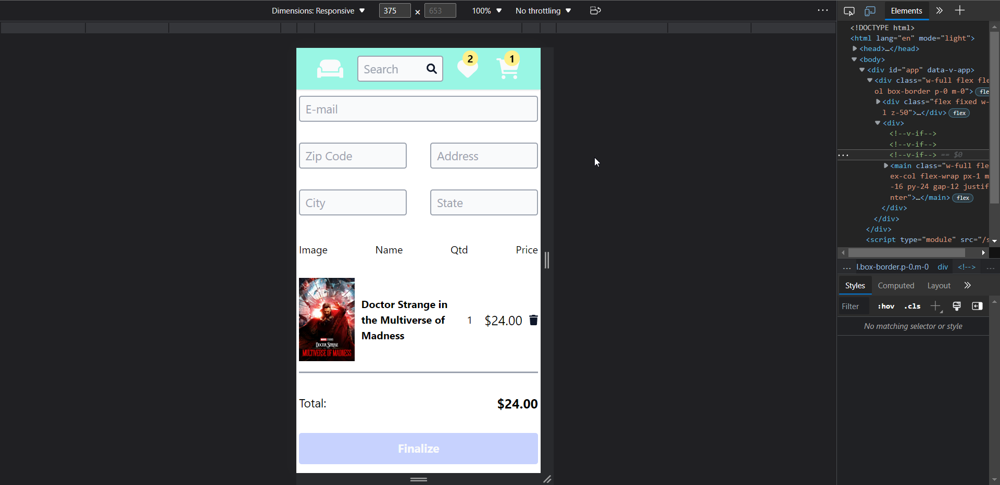

<br/>
<h2>Wassup guys, it was a pleasure to develop this challenge<br/>
I had fun and learned a lot, the application is rich in details. 😄</h2>

<br/>

<h2>Getting started:</h2>
Starting from the first that you already have node installed<br/><br/>

- Clone the repository<br/>

```bash
    $ git clone git@github.com:nand0diaz/movie-shop.git
```

- Open the project folder<br/>

```bash
    $ cd movie-shop
```

- Install dependencies<br/>

```bash
    $ yarn
```

- Run the application<br/>

```bash
    $ yarn dev
```

<br/>

<h2>Dependencies:</h2>
<br/>

- Vue + Vite
- Vue Router
- Tailwind
- ESLint, Prettier
- Axios
- Pinia
- Font Awesome
- Maska

<br/>

<h2>Pages:</h2>
<br/>

- Home
- Checkout

<br/>

<h2>Functionalities:</h2>
<br/>

- Search ✔️
- By clicking on the logo, you will return to the Home ✔️
- Icons to show favorites and cart ✔️
- Number of items in the favorites and cart icons ✔️
- Button to remove items in favorites and cart ✔️
- Button to add to cart and remove from favorites ✔️
- Button to remove item from cart ✔️
- Total price of items in cart ✔️
- Button to go to checkout in cart ✔️
- Button to add to favorites in each Home movie ✔️
- Button to add to cart on each Home movie ✔️
- Button to see the cart in each Home movie if the movie is in the cart ✔️
- Form for user data with mask at checkout ✔️
- Button to remove item from cart at checkout ✔️
- Cart items at checkout ✔️
- Button to complete the purchase if the form is completely filled out at checkout ✔️
- Success modal with user name at checkout ✔️
- Return to Home function when clicking modal button ✔️

<br/>

<h2>Hooks</h2>
<br/>

<h3>appData:</h3>

- getIsFavoritesVisible
- getIsCartVisible
- getIsModalVisible
- showFavorites
- hideFavorites
- showCart
- hideCart
- hideMenus
- showModal
- hideModal

<h3>movies:</h3>

- fetchMovies
- getMovies
- getCart
- getFavorites
- getCartItemsQuantity
- getFavoritesQuantity
- getTotalPrice
- clearSearchInput
- addToCart
- addToFavorites
- deleteAllCartItems
- deleteAllFavorites
- deleteCartItem
- deleteFavorite

<h3>userRegister:</h3>

- getUserRegister
- getUserName
- isUserRegisterFilled
- resetUserRegister

<br/>

- Animations ✔️
- Loader spinner ✔️
- Icons ✔️
- Integration with the TMDb Movie API ✔️
- Responsive ✔️
- Validations and formatting ✔️
- Project developed in 3 days ✔️

<br/>

<h2>Some screenshots from the project</h2>

<br/>









